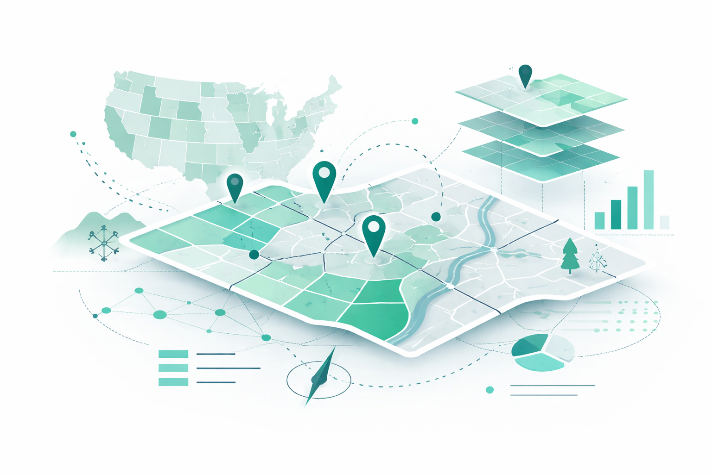
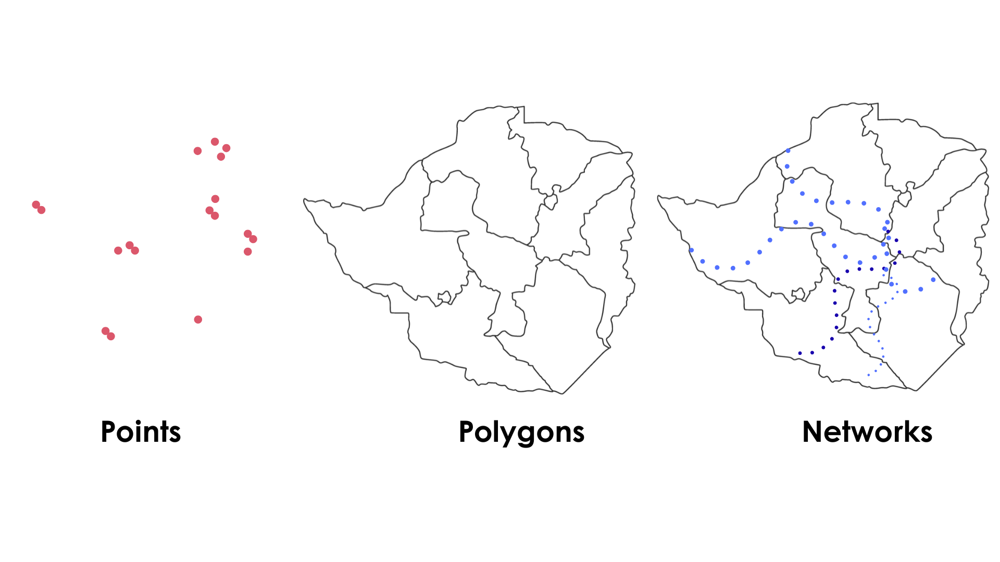
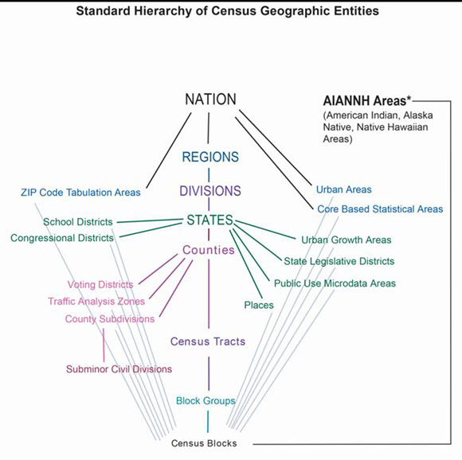
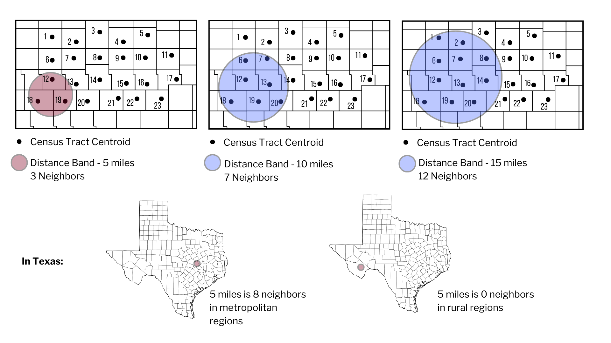

# Welcome

Spatial thinking helps us ask where things are, how they are distributed, and how populations can access care or resources. In rehabilitation, spatial thinking can help us better understand provider distribution, access to care, population need, and differences between regions.

This lesson introduces a few foundational concepts of spatial thinking and serves as a foundation to future lessons on spatial analysis using ArcGIS.

By the end of this lesson, you will be able to:

-   explain what spatial thinking means in health and rehabilitation contexts
-   distinguish between points, polygons, and networks
-   describe why geographic units matter
-   explain why counts alone are often insufficient
-   interpret simple thematic maps more thoughtfully

## Why Spatial Thinking Matters

In rehabilitation workforce and population health research, location is not just an additional variable or background information. Rather, location provides important context and additional meaning to our interpretation.

For example:

-   a county with 10 providers may appear well-resourced until population size is considered
-   a county my appear well-resourced until access is measured with a smaller geographic unit
-   a clinic may be geographically close but still difficult to reach because of structural limitations, such as road networks or travel time

Spatial thinking helps us move from “where are the clinics?” to more meaningful questions such as:

-   Who lives near care?
-   Who has to travel farther?
-   Are providers distributed in proportion to population need?
-   What geographic unit best supports the question we are asking?

# A Simple Framework

Spatial thinking often begins with three basic questions:

1.  **What is the thing being mapped?**\
    Clinic locations, provider counts, population demographics

2.  **What geographic feature is being used?**\
    A point, polygon, line,

3.  **What geographic unit is being used?**

    A State, county, ZIP code, census tract tractCore Spatial Objects

## Geographic Features

### Points

Points represent specific locations. In rehabilitation research, these might include clinic locations, hospitals, or census tract centroids.

::: {.callout-tip appearance="minimal"}
Points are discrete points on the earth's surface that can be identified by a single x (longitude) and y (latitude) coordinate pair.
:::

### Polygons

Polygons represent bounded areas such as counties, census tracts, service areas, or school districts.

::: {.callout-tip appearance="minimal"}
Polygons matter because a spatial pattern can look very different depending on which boundaries are used.
:::

### Networks

Networks represent connected systems such as roads. Networks matter because people do not travel “as the crow flies.” In many health access studies, travel depends on the road network rather than straight-line distance.

::: {.callout-tip appearance="minimal"}
A location that appears nearby on a map may still be difficult to reach if the road network is sparse, indirect, or interrupted.
:::

## Geographic Units

One of the most important ideas in spatial thinking is that results depend on the geographic unit being used.

A map at the county level may hide important local variation. A map at the census tract level may reveal much more detail. The image below describes the [hierarchy of census geographic units](https://www.census.gov/newsroom/blogs/random-samplings/2014/07/understanding-geographic-relationships-counties-places-tracts-and-more.html) in the United States.

## Glossary of Terms

::: panel-tabset
### Block Group

**Definition:**\
Block groups are the smallest units for which the U.S. Census Bureau can report a full range of demographic statistics. There are about 700 residents in each block group.

------------------------------------------------------------------------

### Census Tract

**Definition:**\
Census tracts are small, relatively permanent statistical subdivisions of a county used to provide a stable set of geographic units for the presentation of statistical data.

------------------------------------------------------------------------

### Geospatial Data

**Definition:**\
Geospatial data are those data and products that are clearly geographic in nature, rather than primarily statistical, especially maps and spatial data for use by Geographic Information Systems software and services.

------------------------------------------------------------------------

### Hierarchy Diagram

**Definition:**\
The standard hierarchy of census geographic entities displays the relationships between legal, administrative, and statistical boundaries maintained by the U.S. Census Bureau.

------------------------------------------------------------------------

### United States (Nation)

**Definition:**\
The United States consists of the 50 states and the District of Columbia. The term “Nation” in data products refers to the United States.
:::

# Counts Are Not Enough

A very common beginner mistake is to map counts without considering population.

For example, a county with more clinics may still have worse provider availability if it also has a much larger population.

This is why spatial analysis often uses:

-   rates
-   ratios
-   population-normalized values
-   travel distance or travel time

## Example

Compare these two statements:

-   County A has 8 clinics.
-   County A has 8 clinics for 400,000 residents.

The second statement is much more meaningful because it places the count in context.

# Distance Is Contextual

Distance on a map does not mean the same thing everywhere.

A fixed distance band can capture many neighbors in a metropolitan area and very few in a rural area. This is one reason spatial methods must be interpreted carefully.

::: callout-tip
A 5-mile distance band may include multiple neighboring tracts in a metropolitan region but none in a rural region.
:::

# Reading Thematic Maps Carefully

When interpreting a thematic map, ask:

-   What is being shaded or symbolized?
-   Is the map showing a count, a rate, or an index?
-   What geographic unit is used?
-   What might be missing from the map?
-   Would travel time tell a different story than straight-line distance?

# Putting It Together

A strong spatial question usually combines:

-   a **who** (population)
-   a **where** (geographic unit)
-   a **resource** (provider, clinic, service)
-   a **relationship** (distance, rate, accessibility, clustering)

::: callout-note
## For Example

> How does the population-to-rehabilitation-provider ratio vary across census tracts within a state, and how is this variability associated with demographic and geographic characteristics?
:::

::: callout-note
## For Example

> What is the variability in travel time to outpatient rehabilitation services for older adults living across census tracts in Arizona?
:::

::: callout-note
## For Example

> Which areas experience both low provider density and longer travel times to outpatient rehabilitation services?
:::

------------------------------------------------------------------------

## Practice Activity: Reading Spatial Access Research

Apply spatial thinking by reviewing how geographic concepts are used in published GIS research.

:::::: panel-tabset
### Article 1 — Conceptualizing Spatial Access

**Guagliardo (2004).**\
🔗 <https://ij-healthgeographics.biomedcentral.com/articles/10.1186/1476-072X-3-3>

::: callout-note
**Reflect**

-   How is “access” defined?
-   Why might proximity be misleading?
-   What spatial assumptions are discussed?
:::

------------------------------------------------------------------------

### Article 2 — Network vs Straight-Line Distance

**Delamater et al. (2013).**\
🔗 <https://ij-healthgeographics.biomedcentral.com/articles/10.1186/1476-072X-11-15>

::: callout-note
**Reflect**

-   How does travel network measurement change interpretation?
-   What datasets must be combined?
-   How might rural and metropolitan results differ?
:::

------------------------------------------------------------------------

### Article 3 — Integrated Rural Access Measures

**McGrail & Humphreys (2009).**\
🔗 <https://bmchealthservres.biomedcentral.com/articles/10.1186/1472-6963-9-124>

::: callout-note
**Reflect**

-   What variables are integrated?
-   Why are composite access measures useful?
-   How could this apply to rehabilitation workforce research?
:::
::::::

Key Takeaways

-   Spatial thinking is about more than putting data on a map.
-   Geographic unit choice shapes interpretation.
-   Counts alone are often misleading.
-   Distance and accessibility are not the same thing.
-   Spatial reasoning can strengthen rehabilitation workforce and population health research.

# Session Info

**Audience:** Rehabilitation faculty, students, and researchers beginning to use spatial data\
**Skill level:** Beginner\
**Primary focus:** Foundational spatial reasoning before GIS software workflows
